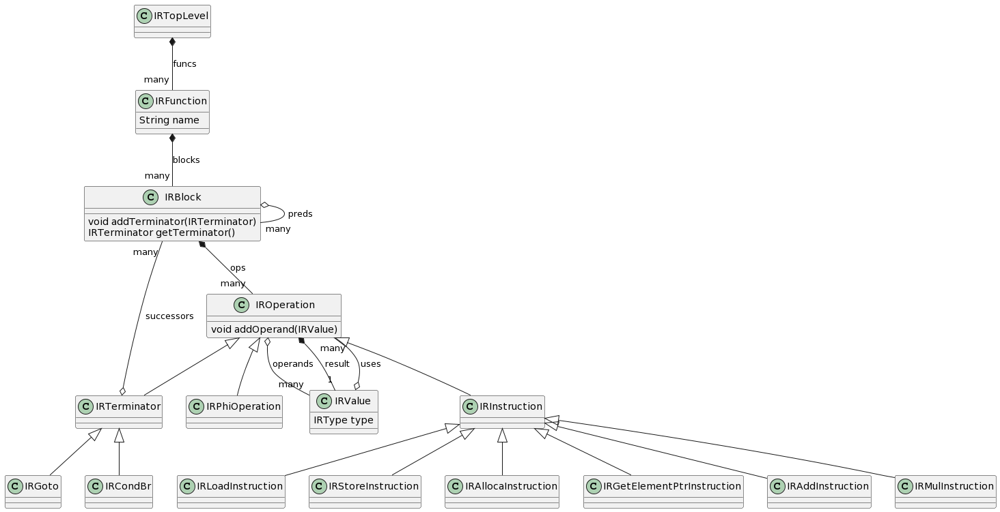

# Travaux pratiques GCC

## Partie 2 : Construction de la représentation intermédiaire

L'objectif de ce TP est de générer la représentation intermédiaire que nous allons utiliser à partir de l'AST généré par ANTLR. 

### Modèle de la représentation intermédiaire

Dans le répertoire `src/main/java/ir`, nous vous fournissons une implémentation d'une IR basée sur les graphes de flot de contrôle et sur la forme SSA. 



L'IR utilisée dans le TP est basée sur un `IRTopLevel` qui possède une liste de fonctions. Celles-ci sont représentées par des `IRFunction` composées d'un nom de fonction, d'une liste d'arguments (liste de `IRValue` dont on parlera plus loin) et d'une liste de blocs. 

Les blocs sont représentés par des `IRBlock` contenants une liste d'opérations et une liste des prédécesseurs dans le graphe de flot de contrôle. Les `IRBlock` ont une contrainte implicite : ils doivent toujours se terminer par une opération spéciale appelée *terminator* (i.e. une opération de branchement). Un bloc pourra connaitre la liste de ses successeurs dans sa fonction en utilisant la liste des successeurs contenue dans le *terminator*.
Enfin un bloc connait la fonction dans laquelle il est contenu. Pour que cette information soit bien à jour, il est préférable de toujours créer les blocs via la fonction `addBlock` des `IRFunction` qui instancie le bloc, le configure correctement et le renvoie.

Les opérations d'un bloc sont représentées par la classe abstraite `IROperation` qui a trois classes filles : `IRTerminator` pour représenter les *terminator* dont on a parlé précédemment, `IRPhiOperation` pour représenter les *phi* et `IRInstruction` pour toutes les opérations qui correspondent à un calcul. La classe abstraite `IROperation` définit une liste de `IRValue` correspondant aux opérandes de l'opération et une `IRValue` correspondant au résultat de l'opération. La liste d'opérande peut être vide et le résultat peut être nul selon l'opération.
- Les `IRTerminator` existent sous trois formes différentes : les `IRCondBr` qui listent deux successeurs (des blocs de l'IR) et qui utilisent un opérande pour décider quel est le successeur à prendre ; les `IRGoto` qui n'ont qu'un seul successeur et pas d'opérandes ; les `IRReturn` qui n'ont pas de destination explicite, mais qui prenne en argument la valeur à retourner.
- La plupart des `IRInstruction` ont un comportement intuitif (AddInstruction fait une addition par exemple). Les instructions permettant de manipuler la mémoire sont plus complexes, mais ne sont pas utilisées dans le compilateur de base (il n'y a pas de tableaux pour le moment dans le langage).
- Les `IRPhiOperation` ne définisse aucun champ de plus que les `IROperation`.

Toutes les opérations doivent être instanciées en utilisant le constructeur de la classe souhaitée. Les arguments de ces constructeurs aident à comprendre le fonctionnement de l'opération en question.

Le flot de données à l'intérieur d'un bloc de l'IR et entre les différents blocs d'une fonction est représenté via les `IRValue`. Ces valeurs représentent des valeurs au sens SSA : elles ne sont créées que par une unique opération et connaissent toutes les opérations qui les utilisent. Ainsi chaque valeur est possédée par l'opération qui la crée et référencée par toutes les opérations qui l'utilisent en opérande. Pour que la liste des utilisations soit bien à jour, nous vous conseillons de bien utiliser la fonction `addOperand` qui permet de l'ajouter à la liste des opérandes d'une opération tout en ajoutant l'opération à la liste des utilisations de la valeur.

### Représentation textuelle de l'IR

Pour pouvoir vérifier le frontend (ou le contourner pour les TP suivants), une forme textuelle de l'IR a été définie. La fonction 

```c
void main() {
	return 1 + 3 * 4;
}
```

a comme IR textuelle : 

``` llvm
function main () : null {
  block_0 {
    goto block_1
  }
  block_1 {
    %1 = 1 : INT
    %2 = 3 : INT
    %3 = add %1, %2 : INT
    %4 = 4 : INT
    %5 = mul %3, %4 : INT
    return %5
  }

}
```
On peut remarquer que cette forme textuelle est une suite de définition de fonctions, toutes composées d'une suite de blocs composés d'une suite d'opérations. Toutes les valeurs manipulées sont sous la forme `%` suivie d'une valeur unique. À partir de cette représentation textuelle, on peut reconstruire l'IR en mémoire de façon directe. 

Dans le TP, vous pouvez générer la forme textuelle de votre IR, ou parser la forme textuelle de votre IR avec les fonctions suivantes : 

```java
IRTopLevel ir = ...;
String exported = exportIR(ir); 
System.out.println(exported); 

IRTopLevel secondIr = importIR(exported);
```


### Algorithme de construction de l'IR

Pour construire notre IR sous la forme CFG + SSA, nous allons utiliser l'algorithme présenté en cours qui permet de construire toute l'IR en même temps.

**Construction du CFG**

La construction des blocs se fait via un visiteur sur les différents noeuds de l'AST. Ce visiteur retourne un `BuilderResult` correspondant à un quadruplet contenant les informations suivantes : 

- Un booléen `hasBlock` qui indique si le visiteur a construit un bloc de l'IR pour traiter le noeud courant
- Deux objets `IRBlock` représentant respectivement le point d'entrée et le point de sortie des blocs créés (si il y en a)
- Une `IRValue` représentant la valeur calculée dans le sous-arbre traité si il y en a une
	
Ces différents éléments vous permettent de construire la graphe de flot de contrôle et les opérations à l'intérieur des blocs.

**Construction de la forme SSA**

En parallèle de la construction du CFG, vous devrez construire la forme SSA. Ainsi, il faudra enrichir la table des symboles pour garder la dernière écriture de chaque variable dans chaque bloc que vous créez dans l'IR. A la lecture d'une variable, vous devrez appeler la fonction `findSSAValueRec` qui a été présentée en cours. 

Comme la construction de la forme SSA se fait en parallèle de la construction du CFG, il est possible que certains blocs de base reçoivent de nouveaux prédécesseurs plus tard dans l'analyse. On introduit donc la notion de blocs `sealed` et non `sealed` : un bloc est marqué comme scellé lorsqu'on est certain qu'il n'aura pas de nouveaux prédécesseurs. Prenons par exemple la fonction `visitBlockNode` en charge de visiter un noeud de l'AST correspondant à la définition d'un bloc. Si on travaille sur le code suivant : 

``` c
{
	int i = 2;
	{
 		i = 3;
	}
	i = 0;
}
```
la fonction sera en charge de traiter le bloc extérieur et lancera des appels récursifs sur tous les fils du noeud représentant ce bloc. L'un des noeuds étant un autre bloc, il renverra un `entryBlock` et un `exitBlock` qui seront à ajouter comme successeur/prédécesseur dans notre CFG. La fonction `visitBlockNode` sur cet exemple doit donc construire un ensemble de trois blocs `B1 -> B2 -> B3` et marquer comme scellé les blocs `B2` et `B3`. Le bloc `B1` sera scellé par la fonction ayant appelé `visitBlockNode` lorsqu'elle aura connecté le point d'entrée retourné correctement. 

Pour rappel, la fonction `findSSAValueRec` gère quatre situations distinctes :

- Si la variable demandée a été écrite dans le bloc courant, il suffit de renvoyer la `IRValue` correspondante
- Sinon si le bloc n'a pas été marqué comme `sealed`, il faut insérer un `phi` sans opérandes, enregistrer le fait qu'il a écrit la valeur dans le bloc courant et enregistrer le `phi` comme étant à traiter au moment ou on scellera le bloc
- Si le bloc est marqué comme `sealed` et qu'il n'a qu'un prédécesseur, il faut faire un appel récursif à ce prédécesseur
- Enfin, si le bloc est `sealed` et s’il a plus d'un prédécesseur, il faut insérer un noeud `phi` et déterminer ses opérandes en lançant un appel récursif à chaque prédécesseur du bloc.
	
Une optimisation possible pour notre IR est de détecter lors de la construction les noeuds `phi` contenant plusieurs fois la même `IRValue`, comme dans l'exemple suivant :

 ``` 
 %v1 = phi %v2, %v2
 ```

 Dans ce cas il est possible de supprimer l'opération `phi` et de remplacer toutes les utilisations de `%v1` par une utilisation de `%v2`. Si cette opération était la dernière écriture d'une variable dans le bloc courant, il faut également supprimer l'écriture de la variable dans le bloc.
 

### Objectifs du TP

Le code qui vous est fourni pour le projet permet déjà de gérer une partie de la conversion. Le visiteur est défini dans la classe `IRBuilder` dans le package `compiler.frontend`. Les points suivants sont déjà implémentés : 
- création du `IRTopLevel` qui contient toutes les fonctions.
- création des `IRFunction` avec le bon nommage **mais** sans gestion correcte des argument, surtout en ce qui concerne la forme SSA
- gestion des `IRBlock` uniquement pour le cas des blocs de base simple présent dans la forme initiale de la grammaire
- gestion de la plupart des operations possibles
	
Pour ce TP, il faut donc ajouter le support pour les structures de controle plus complexe que vous avez ajouté dans le TP précédent. Il faut également gérer les définitions, déclaration et utilisation des variables et implémenter la fonction `findSSAValueRec`.


**Question 1 :**
Implémentez les fonctions permettant de gérer les boucles et les conditionnelles. Pour chacune de ces structures de contrôle, vous devrez créer les différents blocs avec les bon appels recursifs, puis les connecter les uns aux autres. 
Nous vous conseillons de toujours utiliser la fonction privée `createBlock` définis dans le fichier pour créer un nouveau bloc. Cela vous permettra d'ajouter des traitements spéciaux lors de la création de bloc, ce qui sera utile dans la suite du TP. 


**Question 2 :**
Mettez en place un moyen de savoir si un bloc a été scellé (vous pouvez enrichir les `IRBlock` ou créer une `HashMap` donnant l'info pour chaque bloc). 
Définissez une fonction `seal(IRBlock b)` qui permet de sceller un bloc donné en argument. Insérer cette fonction aux bons endroits dans toutes les fonctions qui créent et connectent des `IRBlock` ensemble.

**Question 3 :**
Ajoutez une table dans les `SymbolTableEntry` permettant d'accéder facilement à la dernière écriture d'une variable dans chaque bloc créé dans l'IR. Ajoutez le traitement des noeuds de l'AST correspondant à la définition et à la déclaration d'une variable.

**Question 4 :**
Implémentez la fonction `findSSAValueRec` qui gère les différents cas présentés précédemment. Ajoutez l'appel de cette fonction dans la fonction permettant de traiter les noeuds de l'AST correspondant au référencement d'une variable.

**Question 5 :**
Ajoutez le traitement des `phi` insérés dans les blocs non scellés. Ce traitement doit être fait dans la fonction permettant de sceller un bloc et fera appel à la fonction `findSSAValueRec`. Notez que le noeud `phi` a été ajouté dans le bloc et qu'il faut juste ajouter ses opérandes.

**Question 6 :** Ajoutez une fonction permettant de simplifier les opérations `phi` ayant une seule instance de `IRValue` comme opérande (soit un seule opérande, soit plusieurs fois la même `IRValue`).


