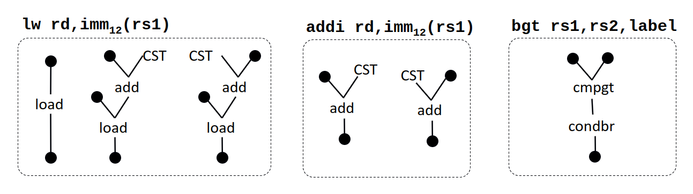

# TP3 - Back-end

L'objectif de la troisième partie du TP est d'écrire un back-end permettant de générer du code assembleur pour un architecture RISC-V avec les extensions IM.

**Note :** Pour simplifier notre backend, nous allons générer un fichier `.s` qui sera ensuite donné à `clang` en combinaison avec des bibliothèques pour générer l'exécutable.

## Présentation de l'IR de back-end

Pour que notre compilateur reste générique, nous avons défini une IR spécifique au back-end, avec une variante spécifique au RISC-V. Dans cette IR, chaque classe de l'IR classique a un équivalent direct permettant la traduction simple de la plupart des objets. 

Les différences majeures résident dans les `IROperation` qui doivent être transformées en `BackendInstruction`. Les `IRValue` doivent elles être transformées en `RISCVRegister`. Les `RISCVRegister` sont ensuite utilisés (avec éventuellement des constantes) pour construire les opérandes des instructions. 

La variante RISC-V du back-end définit des classes spécifiques à chaque instruction de l'ISA. Ces classes héritent de la classe `BackendInstruction` et ajoutent une méthode permettant d'obtenir le texte de l'instruction en assembleur. Pour les opérandes, la variante RISC-V définis trois types d'opérandes : `RISCVImmediateOperand`, `RISCVMemoryOperand` et `RISCVRegisterOperand`. Chaque `RISCVRegister` un champ `physicalRegister` qui désigne le registre physique qui lui est alloué.

**Note :** Une suggestion de progression pour ce sujet vous est proposée en dernière section.

## Le jeu d'instructions RISC-V

Le jeu d'instructions RISC-V est très similaire au MIPS ou au NIOS-II que vous avez vu en cours. La spécification exhaustive des différentes instructions et de l'ABI peut être trouvé [ici](https://github.com/riscv/riscv-isa-manual/releases/download/Ratified-IMAFDQC/riscv-spec-20191213.pdf). Vous pouvez également trouver des *cheatsheets* résumant toutes les instructions et leur utilisation. 

Pour pouvoir tester les programmes compilés, il faut pouvoir générer les binaire et le simuler. Pour cela, nous allons utiliser `binutils` (qui contient l'assembleur et le linker) et `Comet` (qui permet de simuler un binaire RISC-V). Ces différents outils peuvent être compilés de la manière suivante : 

```sh
cd $YOUR_PROJECT_DIR
mkdir tools
cd tools
git clone https://github.com/riscv-collab/riscv-gnu-toolchain.git
cd riscv-gnu-toolchain
./configure --with-arch=rv32im --with-abi=ilp32 --prefix=$YOUR_PROJECT_DIR/tools
make build-binutils -j 8
cd ..
git clone https://gitlab.inria.fr/srokicki/Comet.git
cd Comet
mkdir build
cd build
cmake ..
make -j 8
```

Une fois ces outils compilés, vous avez tout ce qu'il faut pour tester l'exécution d'un fichier `output.s` généré avec votre compilateur : 

```sh
$YOUR_PROJECT_DIR/bin/riscv32-unknown-elf-as output.s -o output.o
$YOUR_PROJECT_DIR/bin/riscv32-unknown-elf-as $YOUR_PROJECT_DIR/lib/lib.s -o lib.o
$YOUR_PROJECT_DIR/bin/riscv32-unknown-elf-ld output.o lib.o -o output.rv32
$YOUR_PROJECT_DIR/Comet/build/bin/Comet.sim -f output.rv32
```


## Etapes du back-end

Cette section décrit les quatre grandes étapes du back-end que vous devez implémenter. 

### Etape 1 : Désambiguation des noeuds phi

Une étape nécessaire pour supprimer facilement les instructions phi est de s'assurer qu'il n'y a pas de conflits liés à la sémantique parallèle des phis.
Par exemple, le code suivant pose un problème car le deuxième phi utilise une variable temporaire définie par le premier phi :

```mlir
x2 = φ(x1, y2)​
y2 = φ(y1, x2)

```
Pour détecter et corriger ces problèmes, vous pouvez parcourir les différents blocs de l'IR et détecter les cas où il existe un cycle de dépendance dans les variables manipulées par les phi du bloc. Si vous détectez un tel cycle, il faudra le *couper* en insérant une copie d'une des variable du cycle vers une variable temporaire.

Par exemple, dans le code suivant, le cycle `x2 -> y2 -> x2 ` peut être coupé en modifiant le bloc d'instruction en :

```
x3 = copy x2
x2 = φ(x1, y2)​
y2 = φ(y1, x3)
```
La variable temporaire ainsi créée sera ensuite allouée à un registre physique pendant la phase d'allocation de registres.


### Etape 2 : Sélection d'instructions

La deuxième étape à réaliser dans notre back-end est la génération de l'IR de back-end et la sélection d'instructions. Comme dit précédemment, la traduction des fonctions et des blocs dans l'IR est simple à mettre en oeuvre. Par contre la traduction des `IROperation` en `BackendInstruction` est plus complexe.

Une solution naïve consiste à faire une assignations directe : une `BackendInstruction` associée à une `IROperation`. Cette solution permet de générer rapidement du code fonctionnel mais inefficace.

Pour raffiner la sélection d'instructions, vous pouvez implémenter l'un des deux algorithmes présentés dans le cours (*MaxMunch* ou programmation dynamique) pour identifier des *patterns* plus complexes. Le jeu d'instructions RISC-V étant relativement simple, il y a peu de *patterns* à identifier :



Ces *patterns* peuvent être généralisés pour les autres instructions avec immédiat et les autres branchements conditionnels.

Certaines opérations de l'IR vont devoir être transformées en plusieurs instructions dans le back-end. C'est le cas par exemple des `call` qui doivent réaliser plusieurs traitements pour respecter les conventions d'appel RISC-V.

### Etape 3 : Allocation de registres

La troisième étape du back-end consiste à allouer des registres physiques aux `RISCVRegister` utilisés dans l'IR de back-end. Pour cela il faut utiliser l'algorithme de coloriage de graphe présenté en cours. Pour rappel, les étapes de l'algorithme sont les suivantes :
 - calcul de la durée de vie des variable (entre les uses et les defs) ;
 - construction du graphe d'interférence ;
 - construction de l'ordre d'élimination parfaite ;
 - coloriage du graphe avec *spilling* si le nombre de registres disponibles est insuffisant.

Une attention toute particulière doit être portée à l'appel de fonctions qui contraint l'utilisation de certains registres. Pour que l'allocation de registres prenne cette contrainte en compte, vous pouvez pré-colorier certains noeuds de votre graphe d'interférence.

Comme le RISC-V dispose de beaucoup de registres, il est probable que vos tests classiques ne posent aucun problème lors de l'allocation de registres. Vous devrez donc construire des *tests de torture* permettant d'exercer les mécanismes de *spilling* de votre allocation de registres.

### Etape 4 : Génération du fichier assembleur

Une fois que votre IR de back-end est correctement générée, il ne reste plus qu'à l'exporter sous forme textuelle. Pour ce faire, vous pouvez utiliser les fonctions `toString()` des différentes `RISCVInstruction` de l'IR de back-end. Il faudra cependant implémenter les méthodes permettant d'exporter les fonctions et les blocs de votre IR. 

## Suggestion de progression

Pour que vous puissiez tester votre back-end, nous vous proposons la progression suivante, qui permet d'arriver très rapidement à une génération de code correcte minimale.

0. Traduction des fonctions et des blocs dans leur équivalent du back-end
1. Sélection d'instructions naïve
2. Allocation de registres
3. Génération d'assembleur
4. Désambiguation des noeuds phi
5. Sélection d'instructions complète
